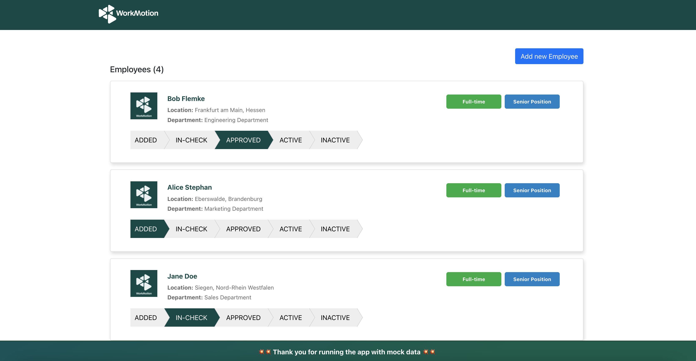
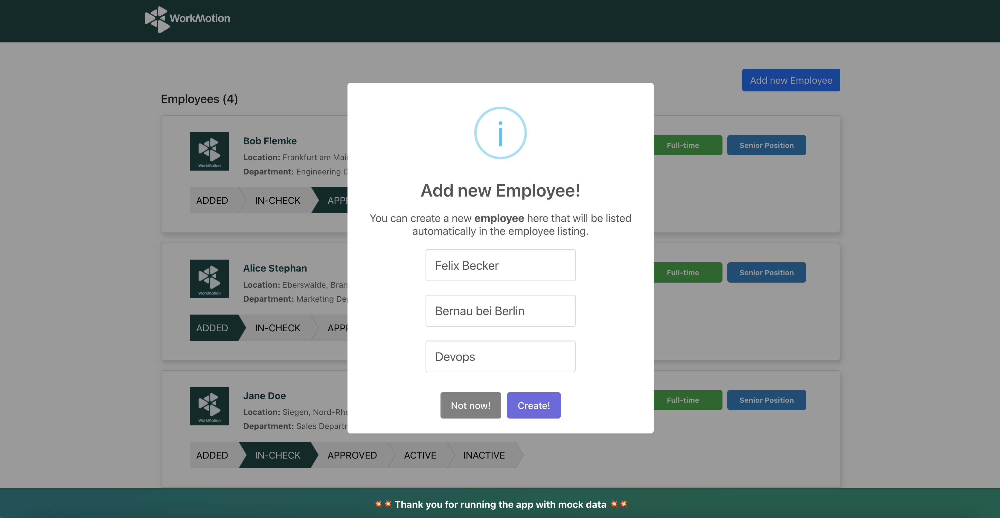

<div align="center" style="background-color: #074946; padding: 20px; margin-bottom: 20px">
  <a href="https://workmotion.com/">
    
  </a>
</div>

<div align="center">Workmotion (www.workmotion.com) is a global HR platform enabling companies to hire & onboard their employees internationally, at the push of a button.</div>

<br/>

<div align="center">
  <a href="https://www.npmjs.com/package/react">
    
  </a>
  <a href="https://workmotion.com/">
    
  </a>
  <a href="https://gitlab.com/dizzbo/frontend/web-homepage">
    
  </a>
</div>

## Table of contents

<hr />

- 🚀 [Getting Started](#getting-started)
- 👥 [Goal](#goal)
- 👏 [User Stories](#user-stories)
- 🛠 [Scenario](#scenario)
- 🌴 [Public API](#public-api)
- 💵 [Application Setup](#application-setup)
- 🛠️ [Tech Stack](#tech-stack)
- 🌴️ [Screenshots](#screenshots)

<a name="#getting-started"></a>

## 🚀 Getting Started

<hr />

The aim of this small project is to develop an employee management system, and display a list of employees along with their statuses. 


<a name="#goal"></a>

## 📚 Goal

<hr />

Develop an application to render the list of employees with application states, and clicking the state should persist in the mmock data. As for now, the Public (API) endpoint to fetch, create and update are not ready yet. Therefore, need to use a mock API in order to GET, POST, and PATCH records.

**Solution must include:**

1. Render a list of employees with some details of a person.
2. Each employee row must have a component to display states.
3. Clicking on any state should persist and next time, the persisted result should be appeared.

**Employees's States are as follows:**

- ADDED
- IN-CHECK
- APPROVED
- ACTIVE
- INACTIVE

<table>
  <tr>
    <td>  </td>
  </tr>
</table>

**Optionally, to make a dashboard more appealing, the below features are also included:**

- Create new employee (with ADDED state) implementation
- Proper templating and taking care of user experience.
- Added splash screen before directly jumping to the employees listing for a smooth transition.

<a name="#user-stories"></a>

## 👏 User Stories

<hr />

- as a user, I want to see the list of employees published by mock API.
- as a user, I want to update the state of the employee, and the updated state should also persist.
- as a user, I want to create a new employee and render it in real time.


<a name="#scenario"></a>

## 🛠 Scenario

<hr />

1. 📥 Open workmotion employee management dashboard on localhost:3000
2. Splash screen with smooth animation should appear 
3. Load employees retrieved from mocked API in cards with some dummy data and logo
4. Also, display employees' states within the card
5. Update and persist on clicking the state
6. Click add new employee button and enter name, department, and location of an employee
7. Submitting button will store new employee in db.json file and rendered right away on the screen


<a name="#public-api"></a>

## ☕ Public API

<hr />

List of endpoints have been developed by using [json-server](https://www.npmjs.com/package/json-server) 

**Get list of employees**
```bash
GET /employees/
```

**Create new employee**
```bash
POST /employees/
```

**Update state of an employee**
```bash
PATCH /employees/{employee_id}
```

**Note:** There are numerous way to create mock data API such as MirageJs, Mockoon, json-server, etc but json-server is simple and quick to implement.

<a name="#application-setup"></a>

## 🔥 Application Setup

<hr />

From installing packages to running the application locally.

In the project root directory, you can run the below commands to run and build the frontend application and mock API.

**IMPORTANT:** Need to open two terminals to run frontend and mock API separately.

### 🚀 Run Frontend

<hr />

### `yarn start`

In order to run the app locally (in the development mode), you can just type `yarn start` in the terminal and press <kbd>Enter</kbd>, and the command will open the application automatically in your default browser.

The app will open in the browser at http://localhost:3000.

### `yarn build`

Builds the app for production to the build folder.
It correctly bundles React in production mode, and optimizes the build for the best performance.

The build will be minified, and the app is ready to be deployed!

### 🚀 Run Mock API

<hr />

### `yarn server`

Enter above command in the terminal to run the mock API using json-server, and the API will be served on http://localhost:5000.

**Note:** The persisted data can be found inside src > __mock__ > db.json, and there are already four records saved in db.json file.


<a href="#tech-stack"></a>

## 🛠️ Tech Stack

<hr />

We have been using the following tech stack for this specific project:

- **[React](https://reactjs.org)** - is used to develop this small project, and to learn more about it please refer to [React Getting Started](https://reactjs.org/docs/getting-started.html)
  

- **[Redux-Saga](https://redux-saga.js.org/)** - is used for the state management because it provides asynchronous approach of handling states, and due to its async behavior, Saga provides handling task concurrency. Read more about [Redux-Saga Getting Started](https://redux-saga.js.org/docs/introduction/GettingStarted)
  

- **[Typescript](https://www.typescriptlang.org/)** = is a strongly typed programming language that builds on JavaScript, giving you better tooling at any scale. Learn more from here [Typescript Documentation](https://www.typescriptlang.org/docs/)
  

- **[Json-Server](https://www.npmjs.com/package/json-server)** - a full fake REST API with zero coding in less than 30 seconds. Read more from here [Getting Started](https://github.com/typicode/json-server#getting-started)
  

<a href="#screenshots"></a>

## Screenshots

<hr />

The screenshots of the application are as follows:

<table>
  <tr>
    <td>  </td>
    <td>  </td>
  </tr>
  <tr>
    <td>  </td>
    <td>  </td>
  </tr>
</table>
